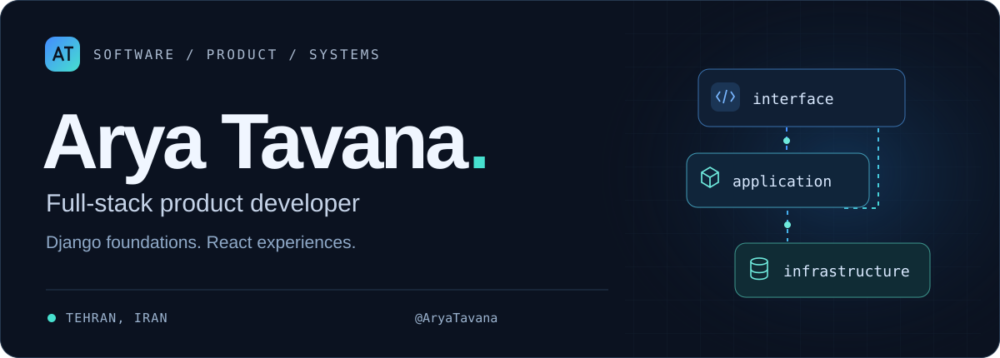
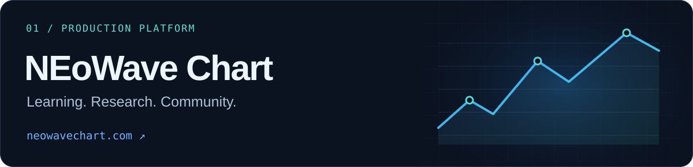

<p align="center">
  <picture>
    <source media="(max-width: 600px)" srcset="./assets/hero-mobile.svg">
    
  </picture>
</p>

<p align="center">
  <a href="https://neowavechart.com/"><strong>NEoWave Chart ↗</strong></a> &nbsp; · &nbsp;
  <a href="https://github.com/AryaTavana/ThoughtHub"><strong>ThoughtHub</strong></a> &nbsp; · &nbsp;
  <a href="https://github.com/AryaTavana/AryaTavana/blob/main/RESUME.md"><strong>Résumé</strong></a> &nbsp; · &nbsp;
  <a href="mailto:aryatavana07@gmail.com"><strong>Get in touch</strong></a>
</p>

<br>

## Thoughtful interfaces. Reliable systems.

I'm **Arya**, a full-stack developer based in **Tehran, Iran**. I build web products from the interface to the infrastructure, with **Django**, **React**, and **TypeScript** at the core.

My work spans subscription platforms, publishing communities, and Discourse extensions. I care about clear user experiences, maintainable code, and the details that keep a product dependable after launch.

- **Building:** [NEoWave Chart](https://neowavechart.com/) — education, research, community, and commerce in one platform.
- **Sharing:** [ThoughtHub](https://github.com/AryaTavana/ThoughtHub) and [Discourse Topic Reply Limits](https://github.com/AryaTavana/discourse-topic-reply-limits).
- **Exploring:** C++, machine learning, and the fundamentals behind better software.

<br>

## Selected work

<a href="https://neowavechart.com/">
  
</a>

### NEoWave Chart

The production platform I develop for NEoWave education and analysis. It brings together learning resources, research, expert Q&A, digital products, and a subscription community.

**What I built:** commerce and payment workflows, member dashboards, subscription entitlements, Discourse SSO, background jobs, and automated deployment.

`Django` `PostgreSQL` `Redis` `Celery` `Docker` `Nginx` `GitHub Actions`

**[Explore the platform ↗](https://neowavechart.com/)** &nbsp; · &nbsp; [Engineering experience](https://github.com/AryaTavana/AryaTavana/blob/main/RESUME.md#product-engineering)

<details>
<summary><strong>Under the hood — product engineering & architecture</strong></summary>

<br>

| Area | Engineering scope |
| :--- | :--- |
| **Commerce** | Product catalogue, checkout, coupons, gifts, wallet funding, payment verification, reconciliation, and idempotent fulfilment. |
| **Memberships** | Central entitlements for community tiers, protected content, downloads, and member benefits. |
| **Member experience** | Authentication, email verification, account dashboards, support tickets, notifications, and transactional email. |
| **Community** | Discourse SSO, subscription group synchronization, and integration with the reply-quota plugin. |
| **Operations** | Containerized services, CI/CD, health checks, rollback support, caching, and backup/restore workflows. |

```text
                      Browser
                         │
                   Nginx / Gunicorn
                         │
                       Django
                         │
       ┌─────────────────┼─────────────────┐
       │                 │                 │
   PostgreSQL          Redis            Discourse
   Product data     Cache + broker    SSO + groups
                         │
                   Celery / Beat
                  Background jobs

   GitHub Actions → Test → Build → Deploy → Health check
```

NEoWave Chart is an independent educational and technology platform based on Glenn Neely's methodology.

</details>

<br>

<table>
<tr>
<td width="50%" valign="top">

<a href="https://github.com/AryaTavana/ThoughtHub"></a>

<h3>ThoughtHub</h3>
<p>A full-stack publishing community for discovering, writing, and discussing ideas.</p>
<p>Block-based authoring, search, saved posts, moderation, notifications, and automatic LTR/RTL content direction.</p>
<p><code>React</code> <code>TypeScript</code> <code>Django REST</code> <code>PostgreSQL</code></p>
<p><a href="https://github.com/AryaTavana/ThoughtHub"><strong>Explore code ↗</strong></a> &nbsp; · &nbsp; <a href="https://thoughthub-aryatavana.alwaysdata.net/">Live app</a></p>

</td>
<td width="50%" valign="top">

<a href="https://github.com/AryaTavana/discourse-topic-reply-limits"></a>

<h3>Discourse Reply Limits</h3>
<p>An open-source plugin connecting community participation to subscription entitlements.</p>
<p>Per-topic group quotas, subscription-cycle carryover, server-side enforcement, admin reporting, and audit history.</p>
<p><code>Ruby</code> <code>Rails</code> <code>Ember / Glimmer</code> <code>RSpec</code></p>
<p><a href="https://github.com/AryaTavana/discourse-topic-reply-limits"><strong>Explore code ↗</strong></a> &nbsp; · &nbsp; <a href="https://github.com/AryaTavana/discourse-topic-reply-limits/blob/main/docs/ARCHITECTURE.md">Architecture</a></p>

</td>
</tr>
</table>

<br>

## My toolkit

| Layer | Technologies I work with |
| :--- | :--- |
| **Backend & APIs** | Python · Django · Django REST Framework · Ruby · Celery |
| **Frontend** | React · TypeScript · JavaScript · HTML · CSS · Tailwind CSS · Bootstrap |
| **Data & infrastructure** | PostgreSQL · Redis · Docker · Nginx · Gunicorn · GitHub Actions |
| **Testing** | Django TestCase · Vitest · Jest · Testing Library · RSpec |

<br>

## Learning in public

Smaller projects where I practice, experiment, and strengthen the fundamentals.

| Repository | Focus |
| :--- | :--- |
| [**C++ Learning**](https://github.com/AryaTavana/Cpp-Learning) | C++ exercises and fundamentals. |
| [**React Learning**](https://github.com/AryaTavana/React-Learning) | Routing, forms, data fetching, TypeScript, and UI testing. |
| [**AI / ML / DL Learning**](https://github.com/AryaTavana/AI-ML-DL-Learning) | Python machine-learning exercises, including Iris classification with k-nearest neighbors. |
| [**Bus Ticket Reservation**](https://github.com/AryaTavana/Bus-Ticket-Reservation) | A C command-line reservation system built around a linked list. |

<br>

## Let's connect

Interested in my work or want to talk about a project? **[Send me an email ↗](mailto:aryatavana07@gmail.com)**

[aryatavana07@gmail.com](mailto:aryatavana07@gmail.com) &nbsp; · &nbsp; [Stack Overflow](https://stackoverflow.com/users/21219212) &nbsp; · &nbsp; [Résumé](https://github.com/AryaTavana/AryaTavana/blob/main/RESUME.md)

<br>


